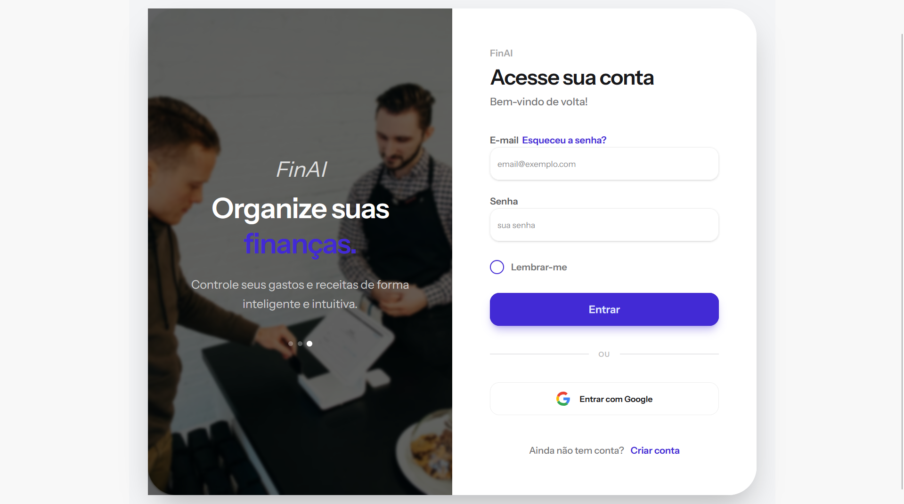
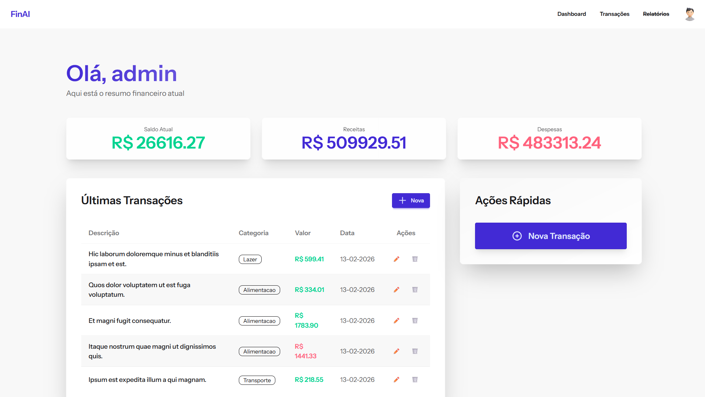
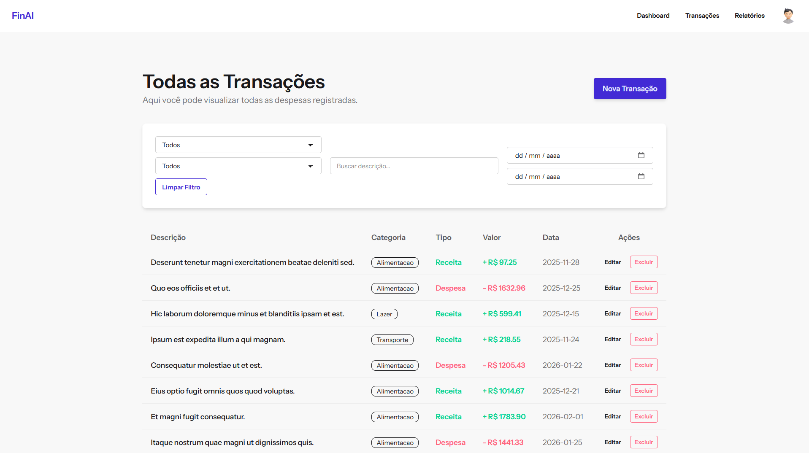

# 💰 FinAI

**FinAI** é um sistema de controle financeiro pessoal inteligente desenvolvido com **Laravel + Vue + Inertia.js**, focado em organização financeira, análise de gastos e geração de insights automáticos com apoio de Inteligência Artificial.

O objetivo do projeto é ir além de um simples CRUD de receitas e despesas, oferecendo uma experiência inteligente, simples e eficiente para controle financeiro pessoal.

---

## Login

## Dashboard

## Transações


## 🚀 Tecnologias Utilizadas

### Backend
- PHP 8+
- Laravel 10+
- MySQL / PostgreSQL
- API de IA (OpenAI ou similar)

### Frontend
- Vue 3
- Inertia.js
- TailwindCSS

---

## 🧠 Funcionalidades

### 📊 Controle Financeiro
- Cadastro de receitas
- Cadastro de despesas
- Edição e exclusão de transações
- Filtros por:
  - Tipo (receita/despesa)
  - Categoria
  - Data
  - Busca por descrição
- Paginação de transações
- Cálculo de saldo atual

### 🔐 Autenticação
- Login via Google OAuth
- Login tradicional com e-mail e senha

### 🤖 Inteligência Artificial *Em desenvolvimento*
- 📌 Resumo financeiro automático mensal
- 📌 Análise de padrões de gastos
- 📌 Identificação de maior categoria de despesa
- 📌 Alertas simples de comportamento financeiro

### 📃 Relatórios *Em desenvolvimento*
- 📌 Geração de relatórios em PDF e Excel

**Exemplo de insight:**
> "Seu maior gasto este mês foi em Alimentação. Seus gastos aumentaram 18% em relação ao mês passado."

---

## 📦 Instalação

### Pré-requisitos
- PHP 8.0 ou superior
- Composer
- Node.js & NPM
- MySQL ou PostgreSQL

### Passo a passo

1. **Clone o repositório**
```bash
https://github.com/MusgoNato/FinAI.git
cd FinAI
```

2. **Instale as dependências do PHP**
```bash
composer install
```

3. **Instale as dependências do Node**
```bash
npm install
```

5. **Configure o banco de dados no `.env`**
```env
DB_CONNECTION=mysql
DB_HOST=127.0.0.1
DB_PORT=3306
DB_DATABASE=finai
DB_USERNAME=root
DB_PASSWORD=
```

6. **Execute as migrations**
```bash
php artisan migrate
```

8. **Inicie o servidor e compile os assets**
```bash
composer run dev
```

Acesse: `http://localhost:8000`


## 👨‍💻 Autor

Desenvolvido com 💙 por Hugo Josue Lema das Neves